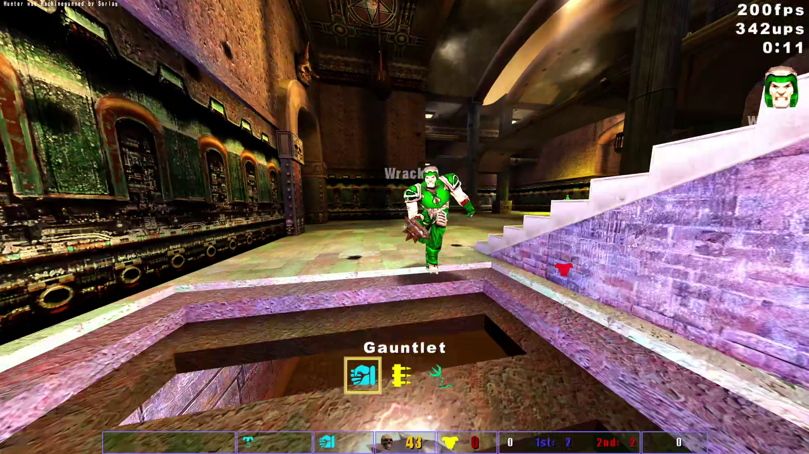
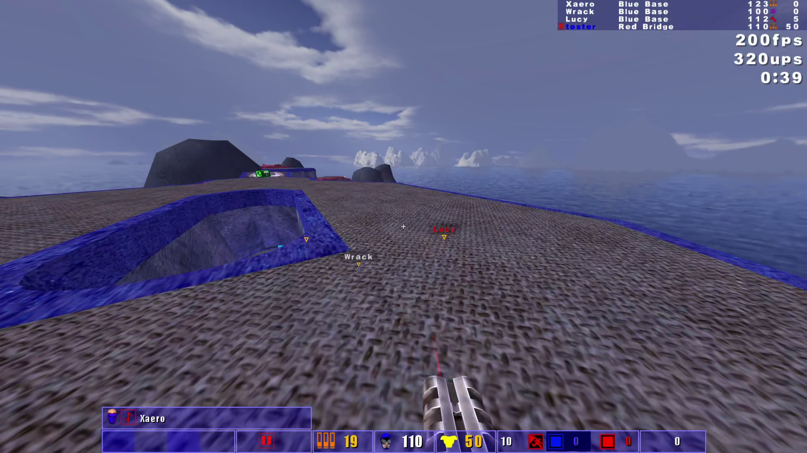
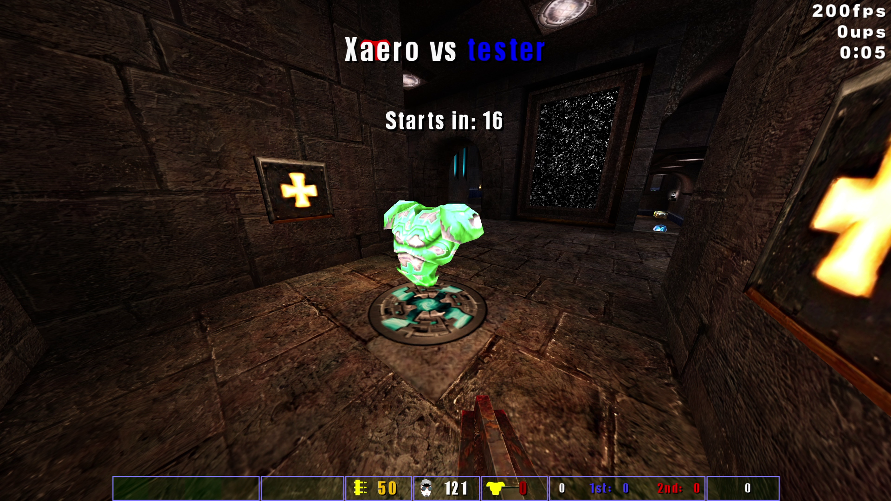
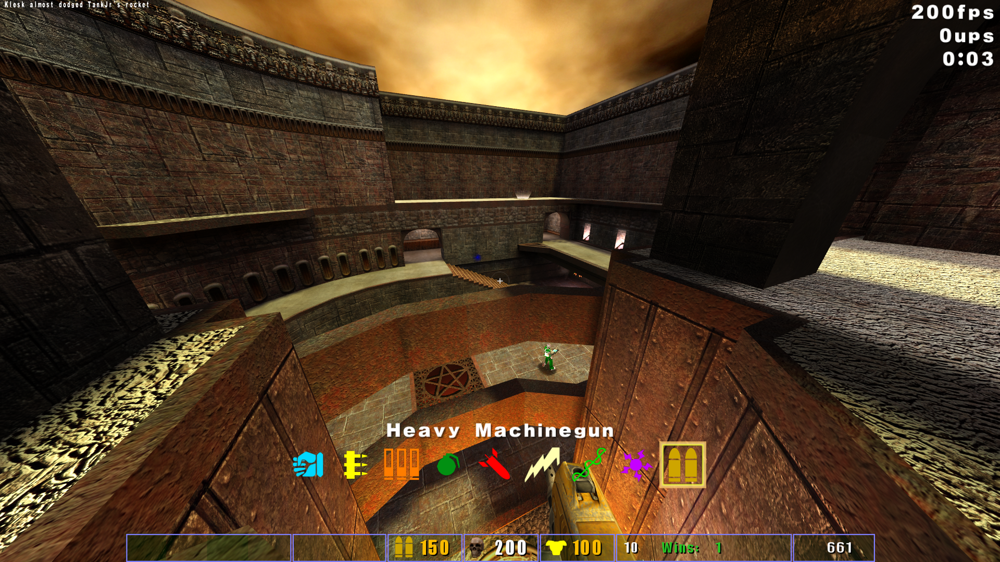

# Quake III Ultimate Arena

Mod based off of Kr3m's missionpack plus with QL features, gametypes, and more!
 
**This is not a replacement for Team Arena! TA maps and virtually all their textures aren't included, meaning you'd still have to legally purchase Team Arena in order to enjoy all of its maps, along with most custom ones designed for TA!**

## Features
* FFA and Clan Arena gametypes. Eventually QL-compatible expanded factories with `g_freeze` for any GT_ enum within reason.
* QL Heavy Machinegun
* QL-Style Nail Bounce
* QL-Style Teammate POIs (`cg_drawFriend 2`)
* Item POIs and timers
* HUD files from QL parse without error. This project strives for near-total CG and UI scripts compatibility with both MPP and QL.
* Unlagged, Instagib, and much more from MPP

## Screenshots
   

## Configuration Guides

For detailed setup instructions based on your use case, please refer to the specific configuration guides:

* [Client Configuration Guide](docs/CLIENT.md) — For client-sided configuration.
* [Server Configuration Guide](docs/SERVER.md) — For server administrators and hosts.

## Installation
 1. Download the release from the side
 2. Extract the ```missionpack2``` folder into your Quake 3 install folder. The ```missionpack2``` folder should be same folder as ```quake3.exe``` file and ```baseq3``` folder.
 3. Ensure directory looks as follows:
 ```
|-C:\Program Files {x86)\Steam\steamapps\common\Quake 3 Arena\ (or something)
   |-quake3.exe
   |-baseq3\
      |-pak0.pk3
      |-...
   |-missionpack2\
      |-pakXX.pk3
      |-...
 ```

## Launching
#### Windows
 - Inside the ```missionpack2``` folder, run ```missionpack2.bat```. If you installed correctly off of CD, Steam, or GOG retail copies, the game should launch.

## Build Instructions
The build system included should be completely portable provided that you are on Windows (with Powershell for final pk3 zipping command).
1. Download the repository in zip file
2. Make a gamedir folder in the root of your Quake 3/ioquake3 install called `missionpack2`
3. Extract the *contents* of the repository folder into `missionpack2`
4. Navigate to `missionpack2\src`
5. Run `make.bat` -- this will compile all 3 QVM modules with `-DMISSIONPACK` and `-DMISSIONPACK2`, copy assets and create core/map .pk3 files ready to go
6. Use the `missionpack2.bat` file in its place to run. Alternatively, as always, you can start the mod with any engine of your choice:
  `<ENGINE_BINARY>.exe +set fs_game missionpack2`
7. FIGHT!

## To do
* 0.58
   * Show dead players in round-based gamemodes (scoreboard and team info)
* 0.60
   * Refactor source
   * undef `MISSIONPACK` and `MISSIONPACK2`
   * Quake Live-ify thigs
* 0.62+
   * QL game factories, `g_freeze`
   * Implement at least Freeze Tag
* TBD
   * New bot difficulty 'Competitive' overrides weapon preferences and bunnyhops at least(?)
   * Off-hand hook
   * Bots can use either type of hook
   * Domination, Attack/Defend, Red Rover, Race
   * Fix scores still being weird pre-round and spectator

 ## Credits
 - **Kevin "Kr3m" Remisoski** for missionpackplus and foundation mods (see <https://github.com/Kr3m/missionpackplus> for additional credits for unlagged code, etc)
 - **Kevin "79DieselRabbit" Worrel** for Frozen Colors map (named as mp2team1 -- we needed at least one amazing custom map supporting 1FCTF, etc)
 - **Hubster** for his famous Aerowalk conversion (named as mp2tourney1 -- green armor!)
 - **Promode Team** PM and FB skins
 - **Dimmskii** for UI work and upscales, QL model conversions, coding, anything else I forgot to mention
 - **Id Software** for Almost Lost map, and everything else making all of this possible!
